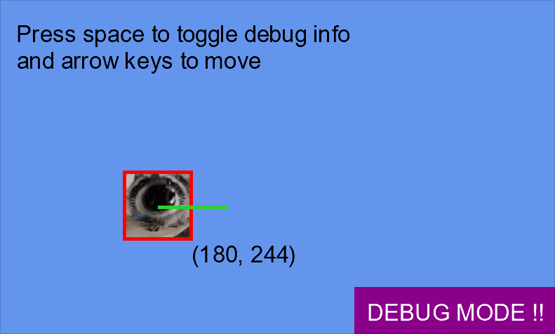
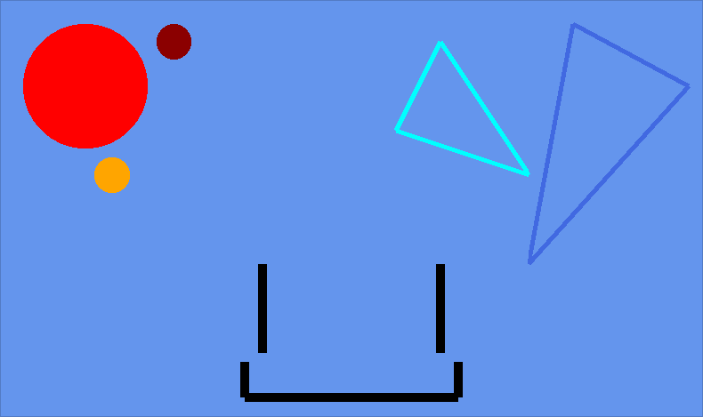

# DebugLib

Hiya !! This is a debug library created for MonoGame for the RIT course IGME 106. 

## Usage
The documentation is built into the code itself with XML comments, as well as right here via markdown (<-- make a link to some markdown documentation later plz). 

Its main function is drawing primative shapes to the screen, and has functions for some basic things like lines, rectangles, and circles. 

In order to implement the library into your own projects, just copy the DebugLib.cs file to your XNA project and change the namespace at the top to your project's namespace :]

## Screenshots

